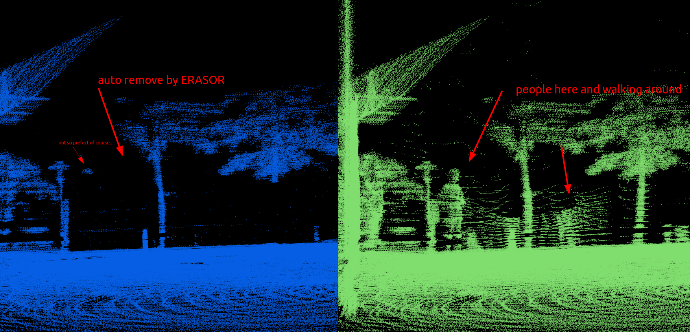

# simple-ndt

This package is extracted from [autoware.ai](https://github.com/Autoware-AI) 1.14.0 version, but with debug fixed, re-factor and speed up.

- fix the empty tf problem, [check the related pull request](https://github.com/autowarefoundation/autoware_ai_perception/pull/60)
- speed up the whole package, more efficient than previous one, could run 10hz stably in 4-core CPU 

Package Usage, using one LiDAR to do SLAM, <u>no IMU no camera needed</u>, of course sometime the result may not good enough, These Ubuntu 16.04-20.04 system with ROS can all run this package:

- Localization
- Mapping
- Dynamics points remove, Kin's fork for directly on this package also: [Kin-Zhang/ERASOR](https://github.com/Kin-Zhang/ERASOR/tree/simple_ndt_slam) from [LimHyungTae/ERASOR](https://github.com/LimHyungTae/ERASOR)

<details>
  <summary>Effects shown here [**remember modify the topic name on config**]</summary>

   Simple_ndt_slam:

   https://user-images.githubusercontent.com/35365764/205377663-ba10b9db-400a-4330-8249-f7abd69247b1.mp4

   Simple_ndt_slam data to ERASOR:

   https://user-images.githubusercontent.com/35365764/205382532-4a6b89b3-f639-4685-bca0-d5867b4f9ea3.mp4

   

</details>


CHANGE LOG:

- 2022/12/2: For more people to use this package, Change README to English version. Here is a [chinese readme before](README_CN.md)
- 2022/10/19: Update: download test Kitti dataset bag: [onedrive link: kitti_sequence11_half.bag](https://hkustconnect-my.sharepoint.com/:u:/g/personal/qzhangcb_connect_ust_hk/EXqmutFjAbpPsYVe5r91KXEBhLlqP7anlNBJqTMHIOkfqw?e=RoRVgF) and follow building steps, modify the bag path in `ndt_mapping_kitti.launch` and roslaunch it.


Real robots/dataset I tried:

- 1x1m Small cars (Velodyne-16)
- quadruped robot (Robosense-16), check [our paper website](http://kin-zhang.github.io/ndem), for our work on Real-time Neural Dense Elevation Mapping for Urban Terrain with Uncertainty Estimations

- [KITTI dataset](https://www.cvlibs.net/datasets/kitti/) (Velodyne-64), teaser bag try [onedrive link: kitti_sequence11_half.bag](https://hkustconnect-my.sharepoint.com/:u:/g/personal/qzhangcb_connect_ust_hk/EXqmutFjAbpPsYVe5r91KXEBhLlqP7anlNBJqTMHIOkfqw?e=RoRVgF) only 876Mb
- HKUST dataset (Ouster-128), check [our dataset webiste](https://ram-lab.com/file/site/multi-sensor-dataset/)
- RS-LiDAR-M1 (special LiDAR but have points cloud is enough for simple_ndt)


## Running
Test on following system: Ubuntu 20.04 noetic, 18.04 melodic, 16.04 kinetic

Can run at any computer if using the docker (as my experience, but please try on real computer if you are running on the real robot)

### Option A: docker
<details>
  <summary>expand to see the docker usage</summary>

Provide the docker also:
```bash
# pull or build select one
docker pull zhangkin/simple_ndt

docker build -t zhangkin/simple_ndt .
```

Running inside:
```bash
docker run -it --net=host --name ndt_slam zhangkin/simple_ndt /bin/zsh
cd src && git pull && cd ..
catkin build -DCMAKE_BUILD_TYPE=Release
roscore

# open another terminal
docker exec -it ndt_slam /bin/zsh
source devel/setup.zsh
roslaunch lidar_localizer ndt_mapping_docker.launch
```


</details>

### Option B: own env computer

Clone and running in your computer
```bash
mkdir -p ~/workspace/mapping_ws/src
cd ~/workspace/mapping_ws/src
# please remember to --recurse-submodules !!!!
git clone --recurse-submodules https://github.com/Kin-Zhang/simple_ndt_slam
```

Install some dependences (glog, gflag)
```bash
cd simple_ndt_slam
sudo chmod +x ./assets/scripts/setup_lib.sh
sudo ./assets/scripts/setup_lib.sh
```

Opne [lidar_localizer/config/ndt_mapping.yaml](lidar_localizer/config/ndt_mapping.yaml), modify the topic name based on your robot setting:
```yaml
lidar_topic: "/velodyne_points"
```

if you are running on the bag, remember to modify the **bag path** in the launch
```html
<arg name="bag_file" default="/home/kin/bags/kitti/semantickitti_sequence11.bag" />
<node pkg="rosbag" type="play" name="bag_play" args="$(arg bag_file) --clock -r 0.8" required="false"/>
```

Build and run, please remember modify the config to point out correct topic name
```bash
cd ~/workspace/mapping_ws
catkin build -DCMAKE_BUILD_TYPE=Release
source devel/setup.zsh # or source devel/setup.bash
roslaunch lidar_localizer ndt_mapping.launch
```

Running image with save map, 0-1 means filter rate, 0 means save all points, normally we will save 0.02-0.1 based how many points in the map

```bash
# open another terminal
source devel/setup.zsh # or source devel/setup.bash
rosservice call /save_map '/home/kin/bags/autoware/cones_people.pcd' 0.0
rosservice call /save_map '/home/kin/ri_dog.pcd' 0.2 # save around 20cm filter voxel
```


### Parameters

1. 需要根据不同的建图场景进行调节，主要调节计入的最大最小距离等

   ```yaml
   # Ignore points closer than this value (meters) (default 5.0)
   min_scan_range: 1.0
   # Ignore points far than this value (meters) (default 200.0)
   max_scan_range: 50.0
   # Minimum distance between points to be added to the final map (default 1.0)
   min_add_scan_shift: 0.5
   ```

2. 如果无需建图，可开启保存一定数量的点云进行运算，把旧时刻的清除

   ```yaml
   save_frame_point: 10
   ```

## Optional: Post-processing

This part are **<u>optional</u>**!! Depends on your interest. You can also ignore these part and only use simple-ndt. Here are multiples.

Following steps are the post-processing to **make odom more accurate (loop-closure)** and to **make global map better (remove dynamic, ghost points)**

### A: Loop Closure

TODO Function: post-processing Loop closure after saving the poses and pcd

### B: Remove dynamics points in the map

Kin's fork for directly on this package also: [Kin-Zhang/ERASOR](https://github.com/Kin-Zhang/ERASOR/tree/simple_ndt_slam) from [LimHyungTae/ERASOR](https://github.com/LimHyungTae/ERASOR)

1. First you need launch with rosbag record in launch files:

   ```xml
     <arg name="record_bag" default="/home/kin/bags/autoware/res_odom_lidar.bag" />
     <node pkg="rosbag" type="record" name="bag_record" args="--output-name $(arg record_bag) /auto_odom /odom_lidar /tf" />
   ```
   Save the global map
   ```xml
   rosservice call /save_map '/home/kin/bags/autoware/all_topics/cones_people.pcd' 0.0
   ```

2. Then use the python scripts to extract the dataset, sorry I didn't with C++ :)

   ```bash
   python3 lidar_localizer_utils/extract_bag.py --bag-path "/home/kin/bags/autoware/res_odom_lidar.bag" --save-dir "/home/kin/bags/autoware/results/res_odom_lidar"
   ```

3. config files modifed which is in [Kin-Zhang/ERASOR](https://github.com/Kin-Zhang/ERASOR/tree/simple_ndt_slam). Modifed all the dir path correct

   ```yaml
   # these three path is needed be changed
   initial_map_path: "/home/kin/bags/autoware/results/cones_people.pcd" # global map save path
   save_path: "/home/kin/bags/autoware/results" # save removed done pcd path
   data_dir: "/home/kin/bags/autoware/results/res_odom_lidar" # same dir with --save-dir
   ```


4. RUN IT! Please check there: [Kin-Zhang/ERASOR](https://github.com/Kin-Zhang/ERASOR/tree/simple_ndt_slam)

Run pcl_viewer to see the effect:

```bash
sudo apt-get install pcl-tools
pcl_viewer -multiview 1 bongeunsa_result.pcd origin_map.pcd
```


## Other Infos

**<u>博文及视频补充</u>** Chinese only

相关参数介绍均在博客中进行了详细介绍：

1. [CSDN: 【Autoware】之ndt_mapping理论公式及代码对比](https://blog.csdn.net/qq_39537898/article/details/115439552#t10)

   这篇全文比较长，如果想简单使用而已，可以直接点链接看参数即可

相关使用视频：

1. [Autoware原装GUI配合使用 bilibili](https://www.bilibili.com/video/BV1k84y1F7xn)
2. [此分支安装及使用视频](https://www.bilibili.com/video/BV18e4y1k7cA/)

后续继续补充时，也会更新相关博文或视频进行说明


### TODO

1. 参考开源包，后续加入回环（g2o/gtsam方式） -> But you can try directly to A-LOAM, LEGO-LOAM, LIO-SAM (+IMU) etcs
2. 做一个建图的GUI以方便大家使用，提供安装包直接安装 无需源码编译版 -> don't except that too much

### Acknowledgement

- Autoware.ai core_perception: [core_perception](https://github.com/Autoware-AI/core_perception) 

- Style Formate: [https://github.com/ethz-asl/linter](https://github.com/ethz-asl/linter)

  ```bash
  cd $YOUR_REPO
  init_linter_git_hooks # install
  linter_check_all # run
  
  init_linter_git_hooks --remove # remove
  ```
✨✨Stargazers, positive feedback

---

[](https://github.com/Kin-Zhang/simple_ndt_slam/stargazers)