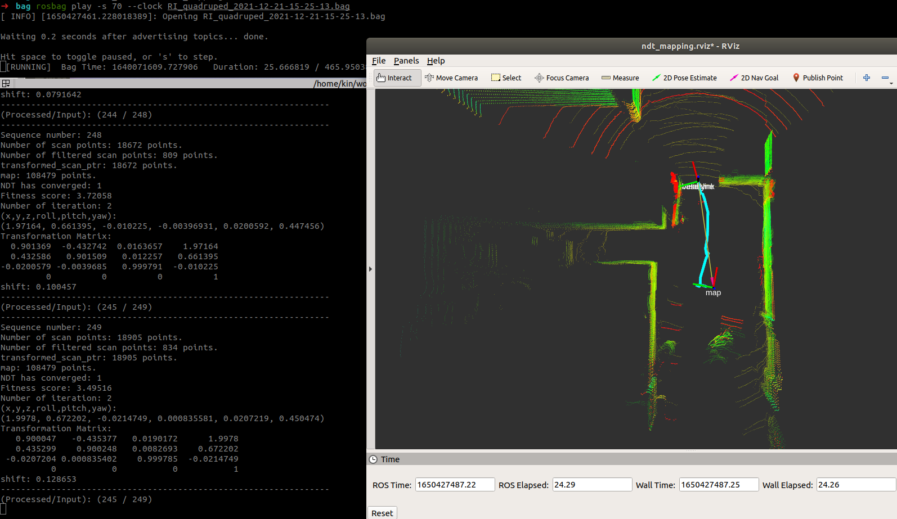
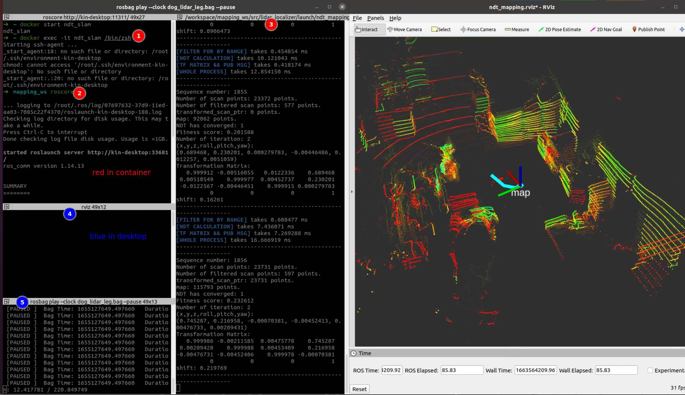
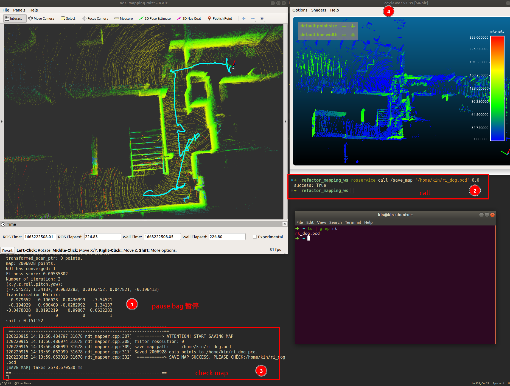

# 简易版建图/定位

主要从[autoware.ai 1.14版本core_perception](https://github.com/Autoware-AI/core_perception) **<u>抽取并重构</u>** 速度上得到了一定的提升
仅留下与slam相关代码 较为简洁 容易部署版并拿到odom；已测试平台 1x1m 小车（Velodyne-16），机器狗（Robosense-16）主要注意topic name对应即可使用

测试系统：【注意 由于boost库版本限制(<1.65)，Ubuntu 20.04 无法运行，如想在20.04上运行 请从docker里弄 将roscore映射好就行】

- Ubuntu 18.04 ROS melodic
- Ubuntu 16.04 ROS kinetic

测试截图：



# 使用说明

## Option: docker

### image pull/build

推荐使用 这样就不用担心自己的环境了

```bash
docker pull zhangkin/ndt_mapping:refactor
```

或者docker build也行 注意把dockerfile 复制一下 然后build

```bash
docker build -t zhangkin/ndt_mapping:refactor .
```

### run container

```bash
docker run -it --net=host --name ndt_slam zhangkin/ndt_mapping:refactor /bin/zsh
cd src && git pull
cd .. && catkin build -DCMAKE_BUILD_TYPE=Release
roscore

# 另开一个终端
docker exec -it ndt_slam /bin/zsh
source devel/setup.zsh
roslaunch lidar_localizer ndt_mapping_docker.launch
```

然后在自身系统正常播包即可，如下图所示



## 拉取 && 编译

注意，如果使用的是docker内无需进行pull操作 直接编译即可

```bash
mkdir -p ~/workspace/mapping_ws
cd ~/workspace/mapping_ws
git clone --recurse-submodules https://github.com/Kin-Zhang/simple_ndt_slam
mv simple_ndt_slam src
```

安装相关依赖（一些ROS包和glog）

```bash
cd src
sudo chmod +x ./assets/scripts/setup_lib.sh
./assets/scripts/setup_lib.sh
```

最后编译 然后经过如下调整相关topic name，参数 和**bag包路径**设置即可直接运行

```bash
cd ~/workspace/mapping_ws
catkin build -DCMAKE_BUILD_TYPE=Release
source devel/setup.zsh
roslaunch lidar_localizer ndt_mapping.launch
```

## 调参

1. 首先检查数据包有激光雷达信息，`sensor_msgs/PointCloud2` 格式

   ```bash
   rosbag info xxx.bag
   
   # ======== 示例输出 ======= topics名字可在config内修改 无需提前规定
   types:       sensor_msgs/PointCloud2 [xxx]
   topics:      /velodyne_points     5359 msgs    : sensor_msgs/PointCloud2
   ```

   打开`src/packages/lidar_localizer/config/ndt_mapping.yaml` 配置文件，修改

   ```yaml
   lidar_topic: "/velodyne_points"
   ```
   
2. 需要根据不同的建图场景进行调节，主要调节计入的最大最小距离等

   ```yaml
   # Ignore points closer than this value (meters) (default 5.0)
   min_scan_range: 1.0
   # Ignore points far than this value (meters) (default 200.0)
   max_scan_range: 50.0
   # Minimum distance between points to be added to the final map (default 1.0)
   min_add_scan_shift: 0.5
   ```

3. 如果无需建图，可开启保存一定数量的点云进行运算，把旧时刻的清除

   ```yaml
   save_frame_point: 10
   ```


在 Launch 中可以直接play bag，请修改路径即可

```bash
source ~/workspace/mapping_ws/devel/setup.zsh
roslaunch lidar_localizer ndt_mapping.launch
```

如需要保存建图结果的pcd, 请暂停bag包（因为map资源会lock住），再开一个终端并运行：

```bash
rosservice call /save_map '/home/kin/ri_dog.pcd' 0.0
rosservice call /save_map '/home/kin/ri_dog.pcd' 0.2 # save around 20cm filter voxel
```

如图所示：




---

**<u>博文及视频补充</u>**

相关参数介绍均在博客中进行了详细介绍：

1. [CSDN: 【Autoware】之ndt_mapping理论公式及代码对比](https://blog.csdn.net/qq_39537898/article/details/115439552#t10)

   这篇全文比较长，如果想简单使用而已，可以直接点链接看参数即可

相关使用视频：

1. [Autoware原装GUI配合使用 bilibili](https://www.bilibili.com/video/BV1k84y1F7xn)
2. [此分支安装及使用视频](https://www.bilibili.com/video/BV18e4y1k7cA/)

后续继续补充时，也会更新相关博文或视频进行说明


# 计划

1. 参考开源包，后续加入回环（g2o/gtsam方式）
2. 做一个建图的GUI以方便大家使用，提供安装包直接安装 无需源码编译版

# Acknowledgement

- Style Formate: [https://github.com/ethz-asl/linter](https://github.com/ethz-asl/linter)

  ```bash
  cd $YOUR_REPO
  init_linter_git_hooks # install
  linter_check_all # run
  
  init_linter_git_hooks --remove # remove
  ```

  

- Autoware.ai core_perception: [core_perception](https://github.com/Autoware-AI/core_perception) 
